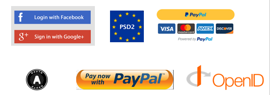
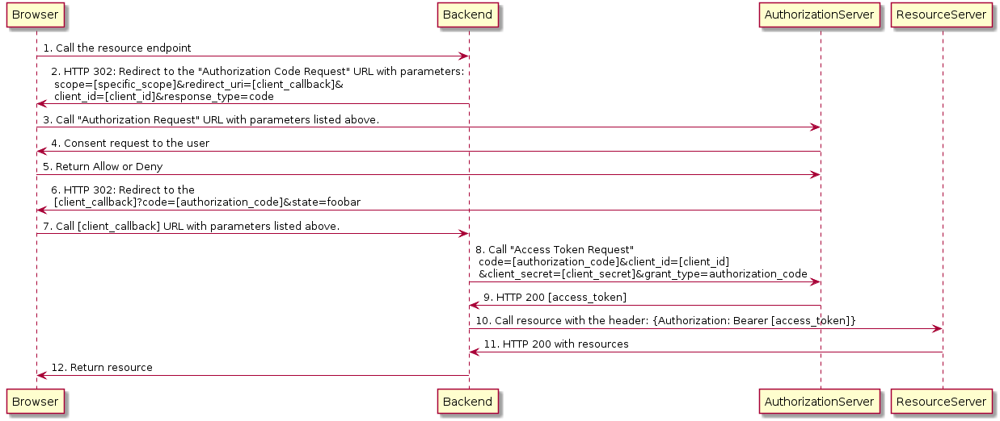

 **Single Sign On**

Single sign on contains OAuth, Saml, Open ID Connect.
OAuth is used by many companies for authorization and authentication purposes. Some of the applications don’t implement OAuth specifications correctly. 

 **OAuth 2.0 Authorization Code Flow**
 
 In the below uml diagram, authorization code flow is drew.
 

**Vulnerable SSO Project**

Vulnerable SSo is focused on single sign on related vulnerabilities.
If you want to learn, you should check this and contribute this project.

VulnSSO tool is focused on sso attacks. Nowadays most of the company uses their own implementation for sso solutions. Some of the bug hunters found really good vulnerability on the big company.
There are some tools(dvwa and others .. ) that contains vulnerability. They don't have any support for sso vulnerability. 

Our focus is only sso related bugs. VulnSSO is training tool.It will contain redirect uri vulnerability , XXE on saml request  and many others.

Vuln SSO project has three app.
- Client App 
- Authentication Server
- Resource Server

**Client App**

This application is used for starting point. It redirects user to authentication server.If end user enters right credentials authentication server redirect user to client app again.

**Authentication Server**

Authentication app is main point of this project.It has login page. This page contains user and password field. Redirected user enters credentials and authentication server checks it.
Spring security has static inmemory feature. This feature accept hardcoded username and password. For this reason there is no database integration in this project.

**Resource Server**

This part main page of application for authenticated users. After authentication process, user will redirect this page.

In this below image, common vulnerabilities are explained.

**Incoming Vulnerability**
- CSRF for state paratemeter
- XSS For SPA Application
- CSRF for token storage issue on SPA side. Leakage of same site cookie ,X-CSRF token 

**Related Bug Bounty**

- [Facebook](http://blog.intothesymmetry.com/2014/04/oauth-2-how-i-have-hacked-facebook.html)
- [Periscope](https://hackerone.com/reports/110293)
- [Periscope](https://hackerone.com/reports/215381)

**References**

- [Baeldung](https://www.baeldung.com/sso-spring-security-oauth2)
- [OAuth RFC](https://tools.ietf.org/html/rfc6749)
